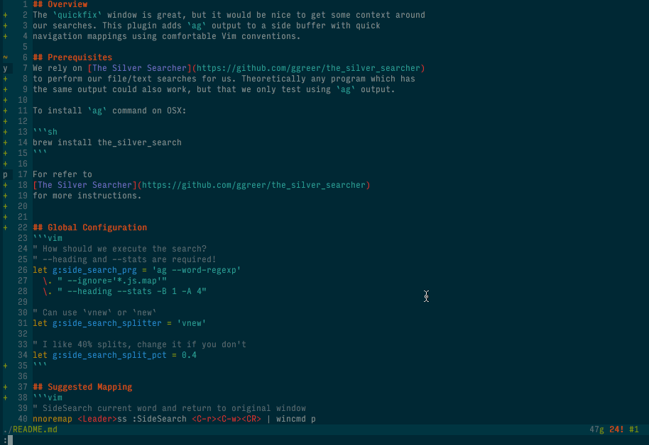

## Overview
The `quickfix` window is great, but it would be nice to get some context around
our searches. This plugin adds `ag` output to a side buffer with quick
navigation mappings using comfortable Vim conventions.



## Features
- step through `ag` output instead of `quickfix` output
- syntax highlighting of `ag` output
- mappable to search current word under cursor
- configurable `g:side_search_prg` similar to `grepprg`
- vertical or horizontal split output via `g:side_search_splitter`


## Prerequisites
We rely on [The Silver Searcher](https://github.com/ggreer/the_silver_searcher)
to perform our file/text searches for us. Theoretically any program which has
the same output could also work, but that we only test using `ag` output.

To install `ag` command on OSX:

```sh
brew install the_silver_search
```

For refer to
[The Silver Searcher](https://github.com/ggreer/the_silver_searcher)
for more instructions.


## Global Configuration
```vim
" How should we execute the search? 
" --heading and --stats are required!
let g:side_search_prg = 'ag --word-regexp'
  \. " --ignore='*.js.map'"
  \. " --heading --stats -B 1 -A 4"

" Can use `vnew` or `new`
let g:side_search_splitter = 'vnew'

" I like 40% splits, change it if you don't
let g:side_search_split_pct = 0.4
```

## Suggested Mapping
```vim
" SideSearch current word and return to original window
nnoremap <Leader>ss :SideSearch <C-r><C-w><CR> | wincmd p

" Create an shorter `SS` command
command! -complete=file -nargs=+ SS execute 'SideSearch <args>'

" or command abbreviation
cabbrev SS SideSearch
```
